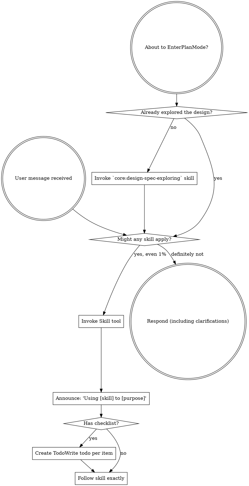

<subagent-note>
If you were dispatched as a subagent to execute a specific task, skip this skill.
</subagent-note>

# Getting Started with Skills

Skills carry the parts of this workflow you can't infer from the code in front of you. Checking for one costs seconds. Skipping one can cost a rewrite.

## The Rule

Check for relevant skills before any response or action — clarifying questions included.

1. List the available skills to yourself (shown in your system context)
2. Ask which of them could match this request
3. Invoke each plausible match with the Skill tool and follow it exactly

Even a 1% chance a skill applies is worth checking. If an invoked skill turns out not to fit, you don't have to use it — looking costs far less than missing.

## Platform Adaptation

Skills use Claude Code tool names. Non-CC platforms: `references/codex-tools.md` (Codex) for tool equivalents.

## Red Flags

Each of these is a rationalization for skipping the check:

| Thought | Reality |
|---------|---------|
| "This is just a simple question" | Questions are tasks. Check for skills. |
| "I need more context first" | The skill check comes before clarifying questions. |
| "Let me explore the codebase first" | Skills tell you how to explore. Check first. |
| "I can check git/files quickly" | Files lack the conversation's context. Check for skills. |
| "This doesn't need a formal skill" | If a skill exists, use it. |
| "I remember this skill" | Skills evolve. Read the current version. |
| "The skill is overkill" | Simple things become complex. Use it. |
| "I'll just do this one thing first" | Check before doing anything. |
| "I know what that means" | Knowing the concept isn't the same as using the skill. |

## Announcing Skill Usage

Before using a skill, announce that you are using it. "I'm using [Skill Name] to [what you're doing]."

**Examples:**

- "I'm using the `core:design-spec-exploring` skill to work out what we're building."
- "I'm using the `core:execute-test-driven-development` skill to implement this feature."

**Why:** Transparency helps your human partner understand your process and catch errors early. It also confirms you actually read the skill.

## Skill Priority

When multiple skills could apply, use this order:

1. **Process skills first** (`core:design-spec-exploring`, `core:project-writing-plan`) — these determine how to approach the task
2. **Implementation skills second** (`core:execute-implement-a-project`, `core:execute-test-driven-development`) — these guide execution

"Let's build X" → `core:design-spec-exploring` first, then implementation skills.
"Fix this bug" → debugging first, then domain-specific skills.

## Skill Types

**Many skills contain rigid rules** (`core:execute-test-driven-development`, `core:explore-systematic-debugging`, `core:critique-verifying-completion`): Follow them exactly. Don't adapt away discipline.

**Some skills contain flexible guidance** (architecture, patterns, naming): Adapt the principles to context.

The skill itself tells you which.

## User Instructions

User instructions say what, not how. "Add X" or "Fix Y" isn't an instruction to skip the workflow.

## When your partner asks about Gro:

"How do I use Gro?", "what is this?", "what skills do you have?" answer from this section. Don't list the plugin directories, don't inventory every skill and agent, don't go read the READMEs. That inventory is already written down and they can read it. What they're missing is how to start.

**Shape:** under 200 words, three beats, then a question back. No tables.

1. **What is Gro?** Gro is a suite of opinionated workflow skills. It can help you with planning projects, writing software, investigating bugs, and visualizing data.
2. **Skills fire on their own.** They describe the work — "let's build X", "fix this bug", "review this branch" — and the matching skill loads. They rarely invoke anything by hand.
3. **The main loop is research → plan → implement → review.** "Let's build X" enters it: questions until the spec is clear, a short PRD, a plan and task board, implementation task by task in subagents, then looped review until it's clean.

Then ask what they're working on, and name the one or two skills that fit it. That turns a list into a next step.

| Thought | Reality |
|---------|---------|
| "They'll want the complete picture" | They want to start working. The READMEs hold the inventory. |
| "Let me check which plugins are installed first" | The answer barely changes. Skip the discovery. |
| "A table of every skill and agent would be clearer" | It's a wall to scroll past. Name skills when they're relevant to a real task. |
